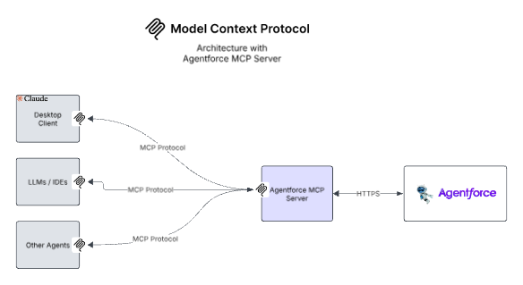

# MCP Architecture with Agentforce



# Agentforce MCP Server

This is an  MCP (Model Context Protocol) server for Salesforce's Agentforce Service Agent. THe MCP Server uses Agentforce Agent API to communicate with the Agent while exposing the main API interfaces as Tools based on the MCP Protocol. 


## 🧩 MCP Tools Exposed

| Tool Name	    | Description                              |
| ------------- | ---------------------------------------- |
| start-session	| Initializes a new Agentforce chat session|
| send-message	| Sends a message to the active session    |
| end-session	| Ends the active session                  |


## 🛠️ Requirements

- Node.js 18+
- Salesforce Org with Agentforce and an active Agentforce Service Agent
- Connected App with Client Credentials OAuth2 flow
- MCP-compatible client (e.g. ChatGPT, Open Interpreter, or custom)

## 📦 Installation

```bash
npm install
```

Or if you're setting up from scratch:
```bash
npm install @modelcontextprotocol/sdk axios zod
```

## 🔧 Build
```bash
npm run build
```

## 🔍 Testing

Use an MCP-compatible client (like MCP Inspector) to call tools and verify responses https://modelcontextprotocol.io/docs/tools/inspector.

- Run the command below 
    ```bash
    npx @modelcontextprotocol/inspector node ./build/server.js \
         <SALESFORCE_ORG_DOMAIN_URL > \
         <CONNECTEDAPP_CLIENTID> \
         <CONNECTEDAPP_CLIENTSECRET> \
         <AGENTID>

    ```
- Navigate to the inspector at http://localhost:5173/ and test your MCP Server
- More info to test MCP Server https://modelcontextprotocol.io/docs/tools/debugging
- More info on setting up and using Agentforce Agent API https://developer.salesforce.com/docs/einstein/genai/guide/agent-api-get-started.html


## 🛡️ Error Handling
All errors are standardized using a centralized error handler. If something goes wrong (e.g., authentication failure), meaningful messages will be shown.

##💡 Notes

This server uses STDIO transport.
If you want to use SSEServerTransport use the sample below

```
import { SSEServerTransport } from "@modelcontextprotocol/sdk/server/sse.js";
import express from "express";

const app = express();
var transport: SSEServerTransport ;

app.get("/sse", async (req, res) => {
  transport = new SSEServerTransport("/messages", res);
  await server.connect(transport);
});

app.post("/messages", async (req, res) => {
  // Note: to support multiple simultaneous connections, these messages will
  // need to be routed to a specific matching transport. (This logic isn't
  // implemented here, for simplicity.)
  await transport.handlePostMessage(req, res);
});

app.listen(PORT);

```